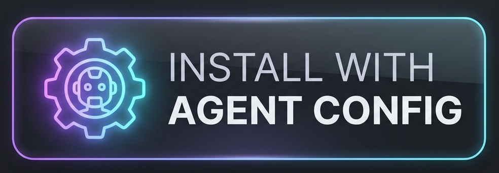

# 🤖 Agent Config

> **Canonical AI agent conventions for consistent, high-quality coding across all tools**

Centralized rule system for Codex, Claude Code, Devin, Cursor, and 30+ AI tools. Single source of truth, per-tool config generation, automatic sync.

## ✨ Features

🎯 **Single source** — Edit once in `.agent-config/rules/`, regenerate everywhere  
⚡ **30+ tools** — Codex, Claude Code, Devin, Cursor, Copilot, Goose, Cline, Kilo, Roo, Warp, Zed  
🔄 **Skills sync** — Canonical `.agent-config/skills/` fans out to all tools  
🔗 **Deeplinks** — Cross-platform `agent-rules://` URLs install rules instantly  
🛡️ **Safety** — ANTHROPIC_API_KEY ban, stable macOS signing, infra patterns  

## 🔧 Installation

**One-line install (registers handler & clones repo):**
```bash
curl -fsSL https://raw.githubusercontent.com/LivioGama/agent-config/main/install.sh | bash
```

**Install Global Content Policy:**
*(Once the handler is installed, click this button to register the policy globally)*

<a href="https://LivioGama.github.io/agent-config/redirect.html?path=rules/global-content-workflow.md"></a>

**Manual install:**
```bash
git clone https://github.com/LivioGama/agent-config.git
cd agent-config
./build.sh
```

Deploys to `~/.claude/`, `~/.codex/`, `~/.devin/`, `~/.cursor/`, `~/.gemini/`.

## 🚀 Quick Start

**Add a rule:**
```bash
vim .agent-config/rules/my-rule.md
./build.sh
git add . && git commit -m "add: my rule" && git push
```

**Install via deeplink:**
```bash
# Install handler first (macOS/Linux/Windows - see docs/deeplink.md)
open 'agent-rules://https://raw.githubusercontent.com/user/repo/main/rule.md'
```

**Use in project:**
```bash
cp -r ~/agent-config/.agent-config ./my-project/
cp ~/agent-config/AGENTS.md ./my-project/
```

## 📖 Documentation

- [Usage Examples](docs/usage.md) — Adding rules, tool-specific rules, skills
- [Deeplink Handler](docs/deeplink.md) — Installation and testing per platform
- [Deeplink Badges](docs/deeplink-badges.md) — Add install badges to your README
- [Platform Support](docs/platform-support.md) — macOS, Linux, Windows details
- [Safety Features](docs/safety.md) — Security guards and patterns
- [Design Philosophy](docs/design-philosophy.md) — Architecture principles

## 🤝 Contributing

1. Add rule → `.agent-config/rules/your-rule.md`
2. Run `./build.sh` to deploy
3. Commit and push

## 📝 License

MIT

---

Made with ❤️ for developers building with AI agents

[⭐ Star](https://github.com/LivioGama/agent-config) if this helps!